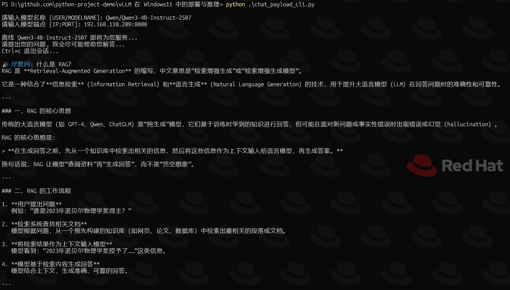
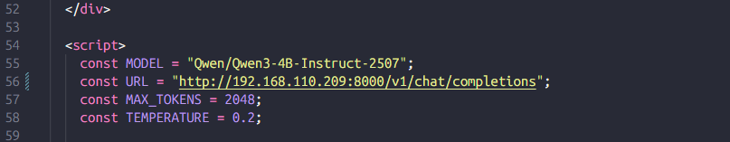
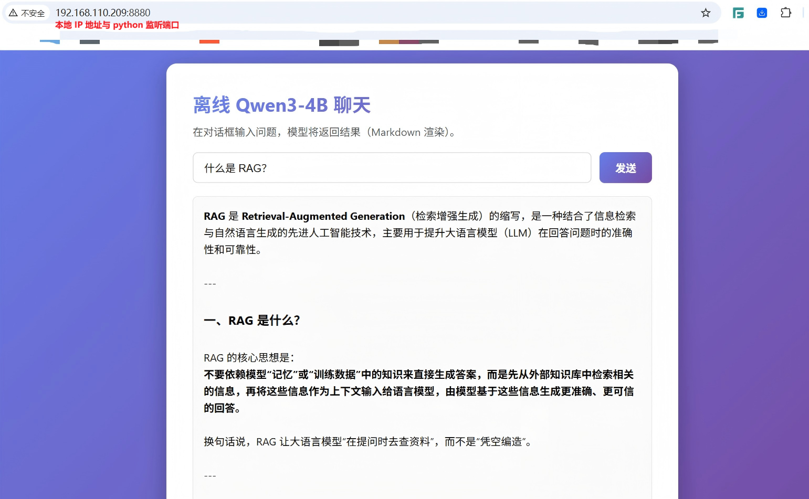

# vLLM 在 Windows11 中的部署与推理

## 文档说明

启动 vLLM 推理服务器面临的困境：

- vLLM 原生只能在 Linux 环境中启动运行
- 先前已测试在 Fedora42 WSL2 中运行 vLLM，但是在 WSL2 中始终无法将其服务端口映射至外部，这就导致了其他服务无法与其对接。

现已找到 Windows 中运行与测试 vLLM 的方法，本文档基于 Win11 环境中部署运行 vLLM 以便后续相关实验的开展。

## 环境所需软硬件要求

| 软硬件名称 | 版本要求 |
| :----- | ----- |
| Python | 3.12.10 |
| GPU | NVIDIA RTX 2000 Ada Generation Laptop GPU |
| CUDA Toolkit | >=11.6 |
| PyTorch | 2.7.1+cu126 |
| vLLM | 0.10.2 |
| Git | 2.44.0 |

- Python、CUDA 驱动、Git 的安装此处不再赘述
- 💥 注意：由于 Win11 的 CMD/PowerShell 无法兼容 Bash，因此在 Win11 中安装并打开 Git-Bash 再运行此脚本。

## vllm_win_navigator 脚本功能

- `--install-vllm` 选项：创建 vLLM 虚拟环境，安装相关依赖与 vLLM 的 whl。

  > 注意：请提前从 https://github.com/SystemPanic/vllm-windows/releases (兼容 windows 的 vllm whl) 下载 whl 至当前目录。

- `--mc-download` 选项：从 ModelScope（魔搭社区）下载指定模型，此处以 Qwen/Qwen3-4B-Instruct-2507-FP8 为例。
- `--hf-download` 选项：从 Hugging Face 开源社区下载指定模型，此处以 Qwen/Qwen3-4B-Instruct-2507 为例。

  > 注意：请提前注册 Hugging Face 账号获取 token，保存此 token 用于后续的 hf 命令行认证登录。

- `--run-vllm` 选项：运行推理服务器，vllm 对不同的模型支持的选项可能存在不同，此处以 Qwen/Qwen3-4B-Instruct-2507 为例。

## 运行 vLLM 推理服务器：

  ```bash
  #切换至当前目录中运行
  $ sh ./vllm_win_navigator --help

  run_vllm_win.sh [OPTIONS]

    OPTIONS:

      --install-vllm    install vLLM
      --mc-download     download models from ModelScope
      --hf-download     download models from HuggingFace through token
      --run-vllm        run vLLM inference server

  $ sh ./vllm_win_navigator --run-vllm
  #运行日志见 vllm 初始化与运行日志.log
  ```

## 客户端模型测试

### 方式 1：python 客户端运行示例
  
```bash
$ python ./chat_payload_cli.py
  
  请输入模型名称：Qwen/Qwen3-4B-Instruct-2507  #指定模型路径，此处为 Hugging Face 中的模型路径，并已下载至本地。
  请输入模型 IP:PORT：192.168.110.209:8000     #指定模型访问 IP 与端口，端口在运行 vLLM 时已指定。

  离线 Qwen3-4B-Instruct-2507 即将为您服务...
  请提出您的问题，我会尽可能帮助您解答...
  Ctrl+c 退出会话...

  🎉 尽管问:   #中英文即可，Qwen3 对中文支持较好。
```


  
### 方式 2：Web 端运行

修改 index.html 中对应 IP 地址与端口以适应本地环境，即 vLLM 监听的 IP 地址与端口：


  
```bash
$ python -m http.server 8880  #在当前目录中运行 Web 服务端
```
  
打开 Web 端访问测试模型，以访问本地地址 http://192.168.110.209:8880：



## 故障拾遗

- Q: 如何获取模型的 metadata？<br>
  A: 可直接访问 `curl -s http://192.168.110.208:8000/v1/models` 获取模型元数据

- Q: 为什么 vLLM 加载启动不同模型后，客户端发送推理请求可能始终出现空消息或无应答的情况呢？

  ```text
  "Hello! It seems like you might have meant to ask something, but your message is empty. 
  Could you please clarify or ask a question? I'm here to help with anything you need \u2014 whether 
  it's a topic to discuss, a problem to solve, or just someone to chat with! \ud83d\ude0a
  ```
 
  A: 不同模型会话推理使用的 Jinja2 模板可能存在差异，vLLM 默认使用内置 OpenAI 模板，这类报错大概率
	   是客户端与推理服务器使用的会话模板 (chat template) 不一致导致。
     因此，`--chat-template-content-format` 选项针对不同的模型需测试。

- Q: 大模型中的格式位宽是什么？<br>
  A: 大模型的格式位宽是指模型权重的格式位宽，包括 INT8，BF16 与 FP16 等。可通过压缩格式位宽实现量化（quantize），在 GPU 资源缺乏的场景中运行量化后的模型。
     vLLM 可在线量化，无需提前下载模型量化的 `.gguf` 文件，比如本示例中运行 Qwen/Qwen3-4B-Instruct-2507 模型采用 `bitsandbytes` 自动量化方式，
     将原始的 BF16（bfloat16）位宽量化为可在 8GB GPU 显存中运行的 INT8 位宽。此模型的原始位宽可查看 [config.json](https://huggingface.co/Qwen/Qwen3-4B-Instruct-2507/blob/main/config.json) 中的 `torch_dtype` 参数。

     | 格式 | 位宽 | 体积 | 精度损失 | 典型用途 | 备注 |
     | ----- | ----- | ----- | ----- | ----- | ----- |
     | **INT4** | 4 bit  | 12.5 % | <3 %   | GGML/GPTQ | 极压缩，>8 GB 卡可跑 |
     | **FP4**  | 4 bit  | 12.5 % | <2 %   | Ada/H100 专用 | NVIDIA 专有 |
     | **INT8** | 8 bit  | 50 %   | <1 %   | **vLLM 在线量化（on-the-fly quantize）**| 零重训练 |
     | **FP8**  | 8 bit  | 25 %   | <0.5 % | Ada/H100 专用 | NVIDIA 专有 |
     | **FP16** | 16 bit | 100 %  | <0.1 % | 通用推理 | 零重训练 |
     | **BF16** | 16 bit | 100 %  | 0 %    | 原始训练 | PyTorch 默认 |
     | **FP32** | 32 bit | 200 %  | 0 %    | 原始训练 | 仅训练阶段 |

- Q: 在 GPU 资源匮乏的场景下，比如本地 8GB GPU 显存，该如何运行 FP16/BF16 权重 (16位) 的模型？<br>
  A: 1️⃣ 模型量化（bitsandbytes 动态量化）；2️⃣ 原始模型 + CPU offload（卸载）
