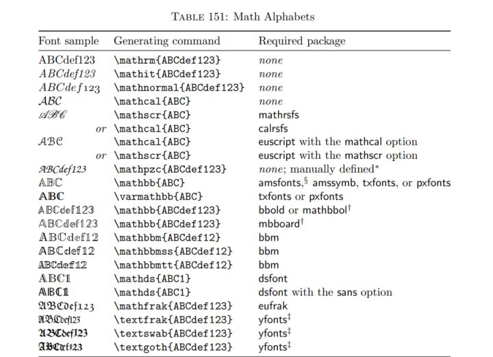
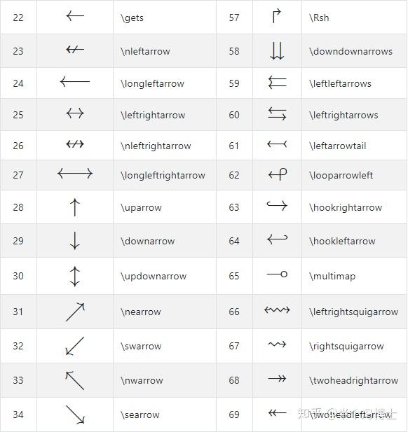
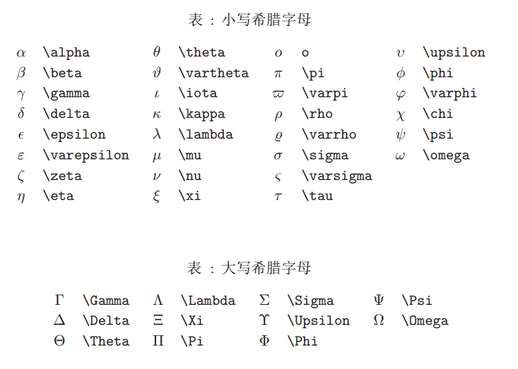

# 🎯 **LaTeX 数学公式编辑常用命令**

## **文档目录**

- [0.前言](#0-前言)
- [1.LaTeX 基本语法](#1-latex-基本语法)
- [2.上标和下标](#2-上标与下标)
  - [2.1 侧上方和侧下方](#21-侧上方和侧下方)
  - [2.2 正上方和正下方](#22-正上方和正下方)
- [3.LateX 花体字体](#3-latex-花体字体)
  - [3.1 标准的 LateX 花体字体](#31-标准的-latex-花体字体)
  - [3.2 Euler 花体](#32-euler-花体)
  - [3.3 Ralph Smith 正式花体（rsfs）](#33-ralph-smith-正式花体rsfs)
  - [3.4 其他花体使用汇总](#34-其他花体使用汇总)
  - [3.5 在 Jupyter Notebook 中的显示](#35-在-jupyter-notebook-中的显示)
- [4.常见数学表达式](#4-常见的数学表达式)
  - [4.1 分式](#41-分式)
  - [4.2 根号](#42-根号)
  - [4.3 极限](#43-极限)
  - [4.4 微分与导数](#44-微分与导数)
  - [4.5 积分](#45-积分)
  - [4.6 矩阵](#46-矩阵)
- [5.常见数学运算符号](#5-常见数学运算符号)
- [6.公式换行与对齐](#6-公式换行与对齐)
- [7.其它](#7-其他)
  - [7.1 无穷大](#71-无穷大)
  - [7.2 波浪线](#72-波浪线tilde-wavy-line)
  - [7.3 箭头](#73-箭头)
  - [7.4 粗体字母](#74-粗体字母)
  - [7.5 空心字母](#75-空心字母)
  - [7.6 希腊字母](#76-希腊字母)
  - [7.7 数学公式中的空格](#77-数学公式中的空格)
  - [7.8 字符右上角的撇](#78-字符右上角的撇)
  - [7.9 各种 “帽子”](#79-各种-帽子)
- [8.参考链接](#8-参考链接)

## **0. 前言**

本文主要介绍在 `LaTeX` 中如何运用各种技巧编辑数学公式，包括上标、下标、花体字体、分式、微分、积分、多行公式对齐、编号控制及特殊符号等。所有的编辑均在 `Jupyter Notebook` 中验证实现，其他环境的的 LaTeX 语法可能存在差异。

LaTeX 可以用来编辑完整的文档，公式编辑只是它的能力范围中一小部分。但是本文将仅限于公式编辑中如何使用 LaTeX 来提高效率。比如说在 Word 的公式编辑器中，不用LaTeX 也可以编辑公式，但是需要频繁地使用鼠标，比较麻烦。善用 LaTeX 的话就可以大大提高效率。

以下输入 LaTeX 示例中，前面是在公式编辑器中输入的字符串，后面是相应的转换效果（事实上就是本编辑器中的公式编辑器的变换效果）。

## **1. LaTeX 基本语法**

**LaTeX 中用美元符号 `$` 来将数学公式与其它文字分隔开来。** 比如说，在有 LaTeX 解释的环境下，如 `Jupyter Notebook Markdown cell` 中输入 $F = ma$，将得到牛顿第二定律的数学表达式。如果用两个美元符号 `$$` 作为两侧定界符的话就可以得到独立表示成一行的数学公式，而且会自动放置在一行的中央。

**LaTeX 排版（Typesetting）命令通常以反斜杠 `\` 开始，而参数则放在花括号 `{}` 中。**

换行符为 `\\`，这个在后面的多行公式编辑中将出现。

## **2. 上标与下标**

### 2.1 侧上方和侧下方

下标用下划线后跟下标字母表示，如果多于一个字母的话，用 `{}` 括住的整体部分变成下标：

- x_k $\Rightarrow$ $x_k$ 
- x_{k_n} $\Rightarrow$ $x_{k_n}$

上标用 `^` 后跟上标字母表示，如果多于一个字母的话用 `{}` 将上标部分括起来（在 Word 中用 `()` 括住的整体部分变成上标），这里与 `Word` 公式编辑器的行为似乎不同。

- x^k $\Rightarrow$ $x^k$
- x^{yz} $\Rightarrow$ $x^{yz}$

上、下标都可以以嵌套的方式追加多层，如以下多层指数的表示方式：

- x^{y^z} $\Rightarrow$ $x^{y^z}$
- \sideset{^1_2}{^3_4}\bigotimes $\Rightarrow$ $\sideset{^1_2}{^3_4}\bigotimes$

### 2.2 正上方和正下方

如果要把上标、下标表示到主题符号的正上方和正下方的话，则需要用 `\limits_` 和 `\limits^`。

- 👉 \sum\limits_{k=0}\limits^{\infty} x(k) $\Rightarrow$ $\sum\limits_{k=0}\limits^{\infty} x(k)$
- 👉 \int\limits_{-\infty}\limits^{\infty} e^(-t)dt $\Rightarrow$ $\int\limits_{-\infty}\limits^{\infty} e^(-t)dt$
- 👉 $\sum\limits_{n=1}\limits^{+\infty}\frac{1}{n^2} = \frac{1}{1^2} + \frac{1}{2^2} + \frac{1}{3^2} + \cdots + \frac{1}{n^2} = \frac{\pi^2}{6}$
- 👉 $\prod\limits_{i=1}\limits^{n} i = n!$

## **3. LaTeX 花体字体**

多数 LaTeX 标准发行版中提供了三种“花色”的字体，其中一些字体需要使用特殊的宏程序包。为此，请在 \documentclass 命令之后和 \begin{document} 之前插入 \usepackage 命令添加宏包。

### 3.1 标准的 LaTeX 花体字体

无需额外的宏包：

- \mathcal{ABCDEFGHIJKLMNOPQRSTUVWXYZ} $\Rightarrow$ $\mathcal{ABCDEFGHIJKLMNOPQRSTUVWXYZ}$

### 3.2 Euler 花体

需要 `euscript` 宏包：

- 添加宏包：\usepackage[mathscr]{euscript}（直接在 `Jupyter Notebook MarkDown cell` 中执行）
- 语法：\mathscr{ABCDEFGHIJKLMNOPQRSTUVWXYZ}
- 显示：$\mathscr{ABCDEFGHIJKLMNOPQRSTUVWXYZ}$（直接在 `Jupyter Notebook MarkDown cell` 中执行）

### 3.3 Ralph Smith 正式花体（rsfs）

需要 `rsfs` 宏包：

- 添加宏包：\usepackage{mathrsfs}（直接在 `Jupyter Notebook MarkDown cell` 中执行）
- 语法：\mathscr{ABCDEFGHIJKLMNOPQRSTUVWXYZ}
- 显示：$\mathscr{ABCDEFGHIJKLMNOPQRSTUVWXYZ}$（直接在 `Jupyter Notebook MarkDown cell` 中执行）

### 3.4 其他花体使用汇总

### 3.5 在 Jupyter Notebook 中的显示

在 Jupyter Notebook 中应该是缺省地加载了以上的一些包，所以并不需要显式地使用 \usepackage 命令就可以直接使用 \mathscr, \mathcal 等指令。而且事实上，连其中的 math 都不需要。比如说在 `Jupyter Notebook MarkDown cell` 中输入：

- \mathcal{T} $\Rightarrow$ $\mathcal{T}$，\cal{T} $\Rightarrow$ $\cal{T}$
- \mathscr{T} $\Rightarrow$ $\mathscr{T}$，\scr{T} $\Rightarrow$ $\scr{T}$

## **4. 常见的数学表达式**

### 4.1 分式

- \frac{a}{b} $\Rightarrow$ $\frac{a}{b}$

### 4.2 根号

- \sqrt{a} $\Rightarrow$ $\sqrt{a}$

### 4.3 极限

- \lim_{x \to +\infty}{f(x)} $\Rightarrow$ $\lim_{x \to +\infty}{f(x)}$

### 4.4 微分与导数

- \frac{\mathrm{d} y}{\mathrm{d} x} $\Rightarrow$ $\frac{\mathrm{d}y}{\mathrm{d}x}$
- \frac{\partial{y}}{\partial{x}} $\Rightarrow$ $\frac{\partial{y}}{\partial{x}}$

### 4.5 积分

- \int^a_b 中的 int 表示积分（integral），`^` 表示积分上限（上标），`_` 表示积分下限（下标）。比如 \int^a_b{f(x)dx} 表示 $\int^a_b{f(x)dx}$
- 以上带有积分上下限的为定积分，不带有积分上下限的为不定积分。
- 💥 注意：此处的上下限不需要像求和符号那样使用 \limits 进行标记！

### 4.6 矩阵

- 向量的转置：
  - 语法：
    - \mathbf{A}^\mathrm{T}
    - \mathbf{A}^\top（专业论文中常用）
    - \mathbf{A}^\mathsf{T}
    - \mathbf{A}^\intercal
  - 显示结果：
    - $\mathbf{A}^\mathrm{T}$
    - $\mathbf{A}^\top$（专业论文中常用）
    - $\mathbf{A}^\mathsf{T}$
    - $\mathbf{A}^\intercal$

- 双绝对值：\Vert norm\Vert $\Rightarrow$ $\Vert norm\Vert$

## **5. 常见数学运算符号**

| 名称 | 显示 | 符号 | 功能 |
|:----- |:----- |:----- |:----- |
| 点号 | $\cdot$ | \cdot | 乘法或点积 |
| 横向省略号 | $\cdots$ | \cdots | 横向多个点号，用 \cdot 的复数形式 |
| 竖向省略号 | $\vdots$ | \vdots | 竖向多个点号，用于列向量或矩阵中 |
| 小圆圈 | $\circ$ | \circ | 通常用于代数中的复合映射、复合作用等 |
| 任意 | $\forall$ | \forall | 常见于数学分析的极限定义中 |
| 存在 | $\exists$ | \exists | $\forall$ 是 Any 首字母倒过来写，$\exists$ 是 Exist 首字母倒过来写 |
| 否定 | $\not$ | \not | - |
| | $\neq$, $\geq$, $\leq$, $\not\geq$, $\not\leq$, $\approx$ | \neq, \geq, \leq, \not\geq, \not\leq, \approx | - |
| | $\in$, $\not\in$ | \in, \not\in | - |
| 二项式系数 | $\binom{n}{k}$ | \binom{n}{k} | - |
| 求模运算 | $\pmod{n}$ | \pmod{n}, \bmod{n} | 前者会加上括号和空格，后者为简写形式 |
| 集合交、并运算 | $\cap$ $\cup$ | \cap, \cup | 集合的交集、并集 |
| 模二加法运算 | $\oplus$ | \oplus | 二进制的运算，等同于 “异或” 运算 |
| 多项组合的交、并、模二加法运算 | $\bigcup$ $\bigcap$ $\bigoplus$ | \bigcup, \bigcap, \bigoplus | - |
| 带上下标的多项组合的交 | $\bigcup\limits_{x \in X} A_x$ | \bigcup\limits_{x \in X} A_x | - |
| 一重积分 | $\int$ | \int | 一重积分运算 |
| 二重积分 | $\iint$ | \iint | 二重积分运算 |
| 三重积分 | $\iiint$ | \iiint | 三重积分运算 |

## **6. 公式换行与对齐**

- 用 `\\` 可以使得公式自动换行，可以把 `\\` 理解为C语言中的 `\n` 的等价物。
- 公式单行输出：$(a-b)^2 = a^2 - 2ab + b^2 = (a+b)^2 - 4ab$
- 公式多行输出：
  $$
  \begin{align}
    (a-b)^2 &= a^2-2ab+b^2 \\
    &= (a+b)^2-4ab
  \end{align}
  $$
- 👉 公式换行输出、以等号对齐并居中显示：`\begin{align}a &= b \\ a + c &= b + c \\ a &= (b + c) - c\end{align}`
- 以上的语法与 `$$\begin{align}a &= b \\ a + c &= b + c \\ a &= (b + c) - c\end{align}$$` 相同，均显示如下公式：
  \begin{align}
    a &= b \\
    a + c &= b + c \notag \\
    a &= (b + c) - c
  \end{align}
- 其中 `$$` 表示居中显示公式，`&=` 表示根据等号对齐，`\\` 表示自动换行。但在 Jupyter Notebook 中，使用仅使用 `$$` 与 `\\` 无法实现公式的居中与自动换行，必须使用 `\begin{align} 与 \end{align}`。
- `\begin{align} 与 \end{align}` 对公式行进行编号，可使用 `\begin{align*} 与 \end{align*}` 取消编号。
- 也可在 `\\` 之前使用 \notag 取消本行编号，如 `a + b =5 \notag \\`。

## **7. 其他**

### 7.1 无穷大

- \infty $\Rightarrow$ $\infty$
- -\infty $\Rightarrow$ $-\infty$
- +\infty $\Rightarrow$ $+\infty$

### 7.2 波浪线（tilde, wavy line）

- 置于字母上方的波浪线：\tilde{a}，\tilde{A} $\Rightarrow$ $\tilde{a}$，$\tilde{A}$
- 置于多个字母上方的波浪线：\tilde{abcd} $\Rightarrow$ $\tilde{abcd}$，可见波浪线不会拉长。因此，可用 \widetilde{abcd} 标记 $\widetilde{abcd}$。
- 独立的波浪线符号：
  - 数学环境：
    - 使用命令 \sim 来输入一个独立的波浪符
    - X is a standard normal distribution random variable, i.e, $X \sim N(\mu,\sigma^2)$.
  - 文本环境：
    - 使用命令 \textasciitilde 或 \texttildelow 来输入一个独立的波浪符，前者让波浪符出现在中间，后者让波浪符出现在下标处。
    - \usepackage{textcomp}（直接在 `Jupyter Notebook MarkDown cell` 中执行）
    - 这是 $\textasciitidle$ 波浪符（直接在 `Jupyter Notebook MarkDown cell` 中执行）

### 7.3 箭头

### 7.4 粗体字母

- 数学环境：
  - 在数学环境中，比较推荐的方式是添加宏包 \usepackage{bm}，使用 \bm{} 命令加粗。
  - \mathbf{}：会变为粗体，但同样会导致数学字母斜体形式的丢失。
  - \boldmath{}：数学环境里可以加粗且不会使斜体消失。需要添加 \usepackage{amsmath} 宏包。
  - \boldsymbol{}：可以对希腊字母加粗。需要添加 \usepackage{amsmath} 宏包。
- 文本环境：
  - \textbf{}：文本环境加粗。在数学环境使用的话，会使斜体效果消失。并且无法输出加粗的希腊字母。

但是在 xelatex 或 Luatex 引擎的 unicode-math 环境中中，\bm{} 会报错。此时，可以使用以下命令：

- \symbfit{}：加粗，且有斜体效果。
- \symbf{}：加粗，没有斜体效果。
- \mathbfcal{}：加粗的 \mathcal 字体

### 7.5 空心字母

- \mathbb{K} $\Rightarrow$ $\mathbb{K}$

### 7.6 希腊字母

### 7.7 数学公式中的空格

| 符号名称 | 显示 | 符号 |
|:----- |:----- |:----- |
| 两个 quad 空格 | $a\qquad b$ | a\qquad b |
| 单个 quad 空格 | $a\quad b$ | a\quad b |
| 大空格 | $a\ b$ | a\ b |
| 中等空格 | $a\;b$ | a\;b |
| 小空格 | $a,b$ | a\,b |
| 紧凑 | $a!b$ | a\!b |

### 7.8 字符右上角的撇

- 一个右上角撇：{\prime} $\Rightarrow$ $x^{\prime}$
- 两个右上角的撇：{\prime \prime} $\Rightarrow$ $x^{\prime \prime}$

### 7.9 各种 “帽子”

| 符号 | 显示 |
|:----- |:----- |
| \hat | $\hat{A}, \hat{x}, \hat{y}, \hat{a}, \hat{b}$ |
| \widehat | $\widehat{A}, \widehat{x}, \widehat{y}, \widehat{a}, \widehat{b}$ |
| \tilde | $\tilde{A}, \tilde{x}, \tilde{y}, \tilde{a}, \tilde{b}$ |
| \widetilde | $\widetilde{A}, \widetilde{x}, \widetilde{y}, \widetilde{a}, \widetilde{b}$ |
| \overline | $\overline{A}, \overline{x}, \overline{y}, \overline{a}, \overline{b}$ |
| \underline | $\underline{A}, \underline{x}, \underline{y}, \underline{a}, \underline{b}$ |
| \overbrace | $\overbrace{A}, \overbrace{x}, \overbrace{y}, \overbrace{a}, \overbrace{b}$ |
| \underbrace | $\underbrace{A}, \underbrace{x}, \underbrace{y}, \underbrace{a}, \underbrace{b}$ |
| \overleftarrow | $\overleftarrow{A}, \overleftarrow{x}, \overleftarrow{y}, \overleftarrow{a}, \overleftarrow{b}$ |
| \overrightarrow | $\overrightarrow{A}, \overrightarrow{x}, \overrightarrow{y}, \overrightarrow{a}, \overrightarrow{b}$ |

## **8. 参考链接**

- [LaTex 学习笔记 ———— LaTeX 公式换行](https://blog.csdn.net/weixin_33744854/article/details/86403457)
- [JupyterLab 使用指南 (七): JupyterLab 使用 LaTeX 生成数学公式](https://blog.csdn.net/imdeity/article/details/139751193)
- [【推荐】LaTex 公式编辑器：告别笨拙的单纯打字符方式](https://www.bilibili.com/opus/730872231290208289)
- [📚【精华】LaTeX 数学符号汇总](https://github.com/Alberthua-Perl/python-project-demo/blob/develop/%E6%B7%B1%E5%BA%A6%E5%AD%A6%E4%B9%A0%E7%B3%BB%E5%88%97/images/LaTex/latex-mathematical-symbols.pdf)
- [📚 Matrices in LaTeX](https://latex-tutorial.com/matrices-in-latex/)
- [Latex Tips: 如何输入矩阵 (illustrated in Jupyter Notebook)](https://chenxiaoyuan.blog.csdn.net/article/details/121968463)
- [【在线工具】LaTex 公式编辑器v1.8.2](https://www.latexlive.com/)
- [CodeCogs LaTeX 在线 API 使用简介](https://www.cnblogs.com/uxod/p/17046563.html)
